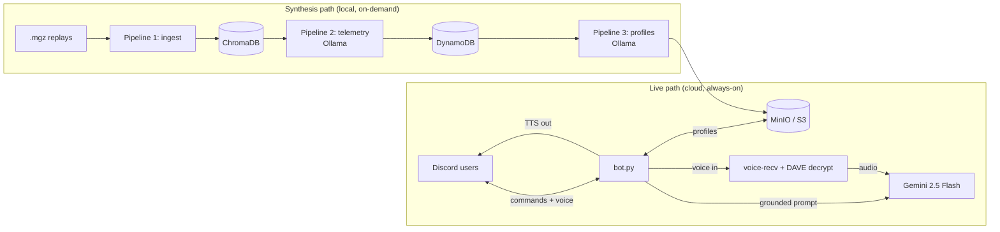

# Teletron — an AoE2 Discord coach that learns from your replays

> A Discord bot that answers Age of Empires II strategy questions grounded in
> **real match data**, holds a **voice conversation** in your channel, and
> builds player profiles by **reverse-engineering the game's replay files** —
> including decrypting Discord's end-to-end-encrypted voice on the way in.

<!-- Badges: uncomment once CI is on the default branch -->
<!--  -->


Built for a competitive Voobly *v1.6* community (a custom Imperial-Age-start,
multi-Town-Center "pocket boom" ruleset that no public strategy guide covers).
The interesting part isn't the bot — it's everything feeding it.

---

## Screenshots / demo

> _Add real captures here:_ `docs/images/ask-command.png`,
> `docs/images/voice-listen.png`. (Placeholders until dropped in.)

| `!gg who should I fear most?` | Voice: "Teletron, how do I beat a knight rush?" |
|---|---|
| _(screenshot)_ | _(screenshot / GIF)_ |

---

## Headline technical wins

**🔓 End-to-end-encrypted voice, decrypted on receive.**
As of March 2026 Discord *mandates* DAVE (MLS-based E2EE) on all voice calls —
clients that opt out are rejected with close code `4017`. `discord.py`'s receive
ecosystem couldn't decode the E2EE layer, so voice-transcription bots simply
broke. The bot participates in the DAVE group and hooks the receive path to
decrypt each frame with the live session key before Opus decode — **330/333
frames decrypted cleanly in live testing**, with undecryptable transition frames
dropped rather than crashing the reader. _(see `age of empire discord bot/voice_listen.py`)_

**🧩 Reverse-engineered an unreadable replay format.**
The community's `.mgz` files are Voobly UserPatch `VER 9.F` — the standard `mgz`
parser fails on them entirely. A low-level body walk recovers the full action
timeline, and header byte-analysis recovers real player names, civilizations,
colors, and spawn positions that the high-level parser returns as null.
_(see `pipeline/replay_parser.py`)_

**📊 Ownership inference — and the integrity to measure it honestly.**
Unit-production commands in this format carry *no player id*. A "proof ledger"
built from the few commands that *do* carry identity attributes production to
players — discarding any object with conflicting evidence rather than guessing.
A full-corpus survey then **corrected an early 3-file estimate of 18-22% down to
a real ~9%** — reporting the less flattering number, with the analysis, is the
point. _(see `docs/OWNERSHIP_RESEARCH.md`)_

**🧠 RAG-grounded LLM advisor.**
Live answers come from Gemini, grounded with server-specific reference data
(exact resource math, build costs, and per-player behavioral profiles) so it
gives *this server's* pocket-boom advice, not generic Dark-Age theory it learned
from the internet. _(see `age of empire discord bot/cloud_llm.py`, `reference_data/`)_

**⚙️ Two-tier LLM pipeline.**
Heavy behavioral synthesis runs **locally on Ollama** overnight (cheap, private);
fast live answers run on **cloud Gemini**. Replays flow ingest → telemetry →
profile through ChromaDB, DynamoDB, and MinIO.

---

## Architecture



The live bot is light and cloud-hosted; the heavy local-LLM synthesis stays on a
workstation and pushes profiles up. See [DEPLOY.md](DEPLOY.md).

---

## Commands (selected)

| Command | What it does |
|---|---|
| `!gg <question>` | Ask anything — grounded in every player profile |
| `!eco` / `!build` | Economy / build-order advice for the server's ruleset |
| `!coach [player]` | Spoken coaching in voice, personalized from replay profiles |
| `!listen` | Join voice; answer "Teletron, …" questions out loud (E2EE decrypt) |
| `!match ally … enemy …` | Set the current matchup so advice is opponent-aware |
| `!ask <player>` | Show a player's synthesized strategic profile |
| `!civ` / `!counter` / `!draft` / `!teams` | Reference + lobby utilities |

---

## Tech stack

Python 3.13 · `discord.py` + `discord-ext-voice-recv` + `davey` (DAVE E2EE) ·
Google **Gemini** (live) · **Ollama** `llama3.2` / `qwen2.5:7b` (local synthesis) ·
**ChromaDB** · **DynamoDB-local** · **MinIO** (S3) · the `mgz` replay library ·
FFmpeg + gTTS (voice) · Docker Compose · GitHub Actions.

## Quick start

Local dev needs Docker (for MinIO/ChromaDB/DynamoDB) and a `.env` with a Discord
token + Gemini key (`.env.example` shows the shape). Cloud deployment to a free
always-on VM is documented step-by-step in **[DEPLOY.md](DEPLOY.md)**.

```bash
pip install -r "age of empire discord bot/requirements.txt"
python "age of empire discord bot/bot.py"
```

## Honest limitations

- **Ownership attribution ~9%** of unit production (median game lower) — the
  format simply doesn't record most of it; the bot never guesses the rest.
- **Local LLM is CPU-only** on the dev machine (old GPU) — synthesis is a slow
  overnight batch by design, which is why live answers use cloud Gemini.
- **Voice input** needs the `davey` library built for the host CPU (ARM on the
  free VM) — a documented follow-up; the bot speaks without it.

## More

- 📖 **[PROJECT_CASE_STUDY.md](PROJECT_CASE_STUDY.md)** — the full story: what I set
  out to build, how it changed on contact with reality, and what I learned.
- 🔬 **[docs/OWNERSHIP_RESEARCH.md](docs/OWNERSHIP_RESEARCH.md)** — the replay
  reverse-engineering log.
- 🗺️ **[TELEMETRY_PLAN.md](age%20of%20empire%20discord%20bot/TELEMETRY_PLAN.md)** — the pipeline design.

## License

MIT — see [LICENSE](LICENSE).
